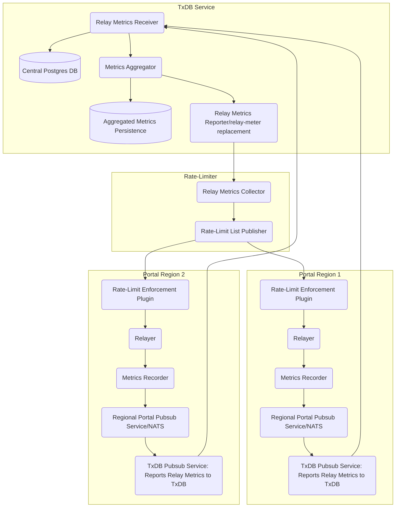

TxDB as replacement for relay-meter

```mermaid
flowchart

    %% TxDB Service
    %% -------------------------------------
    subgraph txdbs [TxDB Service]
    receiver(Relay Metrics Receiver)
    pgA[(Central Postgres DB)]
    aggA(Metrics Aggregator)
    persistenceA[(Aggregated Metrics Persistence)]
    meterA(Relay Metrics Reporter/relay-meter replacement)
    
    receiver-->pgA
    receiver-->aggA
    aggA-->persistenceA
    aggA-->meterA
    
    end
    
    %% Portal Region 1
    %% -------------------------------------
    subgraph pi1 [Portal Region 1]
    relayer1(Relayer)
    lim1(Rate-Limit Enforcement Plugin)
    metrics1(Metrics Recorder)
    pubsub1(Regional Portal Pubsub Service/NATS)
    tx1(TxDB Pubsub Service: Reports Relay Metrics to TxDB)

    metrics1-->pubsub1
    pubsub1-->tx1
    relayer1-->metrics1
    lim1-->relayer1
    end

    %% Portal Region 2
    %% -------------------------------------
    subgraph pi2 [Portal Region 2]
    relayer2(Relayer)
    lim2(Rate-Limit Enforcement Plugin)
    metrics2(Metrics Recorder)
    pubsub2(Regional Portal Pubsub Service/NATS)
    tx2(TxDB Pubsub Service: Reports Relay Metrics to TxDB)

    relayer2-->metrics2
    metrics2-->pubsub2
    pubsub2-->tx2
    lim2-->relayer2
    end

    subgraph rateLimiter [Rate-Limiter]
    rateLimiterCollector(Relay Metrics Collector)
    rateLimitsPublisher(Rate-Limit List Publisher)
    
    rateLimiterCollector-->rateLimitsPublisher
    end


    %% Connections between subgraphs
    %% -------------------------------------
    tx1-->receiver
    meterA-->rateLimiterCollector
    rateLimitsPublisher-->lim1
    
    tx2-->receiver
    rateLimitsPublisher-->lim2
```
